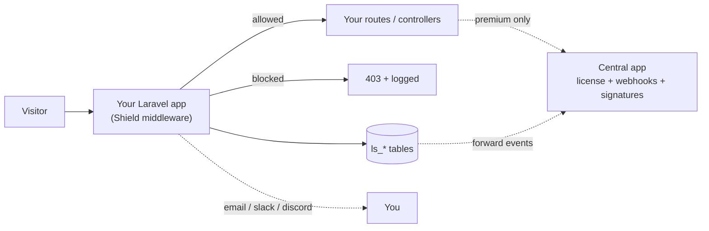

# Laravel Shield, Setup & Env Guide (ELI5)

::badge[Package]{color=purple} ::badge[Laravel 9-12]{color=blue} ::badge[Free + Premium]{color=green}

A friendly, explain-it-like-I-am-5 guide to installing `ozankurt/laravel-shield` and every `.env` variable it understands. If you can copy-paste and read a table, you can set this up.

[[toc]]

---

## 1. What is this thing? (the 30-second version)

Laravel Shield is a **security guard for your Laravel app**. It sits in front of your routes and:

- **Blocks bad traffic** (SQL injection, XSS, bad bots, banned IPs/countries) before it reaches your code.
- **Scans your files** for malware and tells you when files change unexpectedly.
- **Logs everything** in a tamper-evident audit trail.
- **Pings you** (email / Slack / Discord) when something bad happens.
- Optionally talks to a **Central app** (your licensing + reporting server) for premium features.

> [!TIP]
> You do not need to understand every feature to start. Install it, unlock the dashboard, and turn features on one at a time with the `.env` switches in Section 6.

---

## 2. How the pieces fit together



- **The package** lives inside your app. It does all the blocking, scanning, and logging locally.
- **The Central app** is optional and separate. It only matters for **premium** features (license checks, real-time signature feeds, pushing events to a central dashboard). Free installs never need it.

---

## 3. Before you start (requirements)

|  |  |
|--|--|
| PHP | 8.0 or newer |
| Laravel | 9, 10, 11, or 12 |
| Database | MySQL / PostgreSQL / SQLite (it makes `ls_*` tables) |
| Recommended | Redis (for fast caching + queues) |

---

## 4. Install it (2 commands)

```bash
composer require ozankurt/laravel-shield
php artisan shield:install
```

That second command is **safe to run more than once**. Here is what it does for you, in plain English:

1. Copies its config to `config/shield.php`, plus migrations, language files, and dashboard assets.
2. Creates its database tables (`ls_*`) and fills in lookup data.
3. Seeds ~47 built-in firewall rules and ~33 malware signatures so it works out of the box.
4. **Writes two secret keys into your `.env`** for you (more on these in Section 5).
5. Offers to whitelist your current IP so you do not lock yourself out.

> [!IMPORTANT]
> The dashboard is **locked by default**. Nobody can see it until you do Section 5.2. This is on purpose.

---

## 5. The 3 things you must do after installing

### 5.1 The two auto-generated secrets

The installer adds these to your `.env`. **Do not share them, do not delete them.**

| Variable | ELI5 |
|---|---|
| `LS_AUDIT_HMAC_SECRET` | A tamper-proof wax seal. Every audit-log row is signed with it, so nobody can secretly edit your security history. |
| `LS_BYPASS_KEY` | Your "let me back in" master key. If you ever block yourself, a request with this key skips all checks. Keep it somewhere safe. |

> [!CAUTION]
> If you change `LS_AUDIT_HMAC_SECRET` later, older audit rows will look "tampered". Set it once and leave it.

### 5.2 Unlock the dashboard

Shield asks one question before showing the dashboard: *"is this person allowed?"* You answer it with a gate in your app:

```php
// app/Providers/AppServiceProvider.php  ->  boot()
use Illuminate\Support\Facades\Gate;

Gate::define('viewShieldDashboard', fn ($user) => $user && $user->is_admin);
```

Swap `$user->is_admin` for whatever "this is an admin" means in your app. Now visit `/shield`.

### 5.3 Make sure the scheduler runs

Shield schedules its own background jobs (file drift checks, signature sync, IP unblocking). If you already run Laravel's scheduler, you are done:

```bash
# this one line in your server cron is all Laravel needs
* * * * * cd /path-to-app && php artisan schedule:run >> /dev/null 2>&1
```

---

## 6. The `.env` reference (the big one)

Every variable is **optional**, the defaults are sane. Turn things on as you need them. Legend:

::badge[Free]{color=green} works on every install ::badge[Premium]{color=purple} needs a license + Central ::badge[Optional dep]{color=gray} needs an extra composer package

### 6.1 Master switch & core ::badge[Free]{color=green}

| Variable | What it does (ELI5) | Default |
|---|---|---|
| `FIREWALL_ENABLED` | The big on/off switch for the whole firewall. | `true` |
| `FIREWALL_DASHBOARD_ENABLED` | Show the `/shield` dashboard at all. | `true` |
| `FIREWALL_WHITELIST` | Comma list of IPs/CIDRs that are always trusted (never blocked). | `127.0.0.0/24` |
| `FIREWALL_DB_CONNECTION` | Which DB connection Shield writes to. | your `DB_CONNECTION` |
| `FIREWALL_DB_PREFIX` | Table-name prefix for legacy tables. | `security_` |

### 6.2 Lockout recovery (do not skip) ::badge[Free]{color=green}

| Variable | What it does (ELI5) | Default |
|---|---|---|
| `LS_BYPASS_KEY` | Master "let me in" key (sent as header `X-Security-Bypass`). | auto-generated |
| `LS_BYPASS_IPS` | Comma list of IPs that can never be blocked and cannot be removed from the UI. Great for your office IP. | empty |

> [!WARNING]
> If you ever lock yourself out from a strange network, the bypass key or `php artisan shield:bypass-add <ip>` will save you. Set this up *before* you need it.

### 6.3 Speed & storage ::badge[Free]{color=green}

For small sites, ignore this. For busy sites, write logs through a queue so requests stay fast.

| Variable | What it does (ELI5) | Default |
|---|---|---|
| `LS_STORAGE_DRIVER` | How logs are written: `sync` (now), `queue` (background), `redis_batch` (fastest). | `sync` |
| `LS_QUEUE_CONNECTION` | Which queue connection to use when `driver=queue`. | your default |
| `LS_QUEUE_NAME` | Which queue name Shield jobs go on. | `shield` |

```env
# Busy-site recipe
LS_STORAGE_DRIVER=queue
LS_QUEUE_CONNECTION=redis
LS_QUEUE_NAME=shield
# then run: php artisan queue:work --queue=shield
```

### 6.4 Who gets alerted, and how ::badge[Free]{color=green}

**Step 1, pick which events alert you.** (`false` by default so you are not spammed on day one.)

| Variable | Alerts you about |
|---|---|
| `FIREWALL_NOTIFICATIONS_ATTACK_DETECTED_ENABLED` | A blocked attack. |
| `FIREWALL_NOTIFICATIONS_FAILED_LOGIN_ENABLED` | A failed login. |
| `FIREWALL_NOTIFICATIONS_SUCCESSFUL_LOGIN_ENABLED` | A successful login. |
| `FIREWALL_NOTIFICATIONS_INTEGRITY_CHANGED_ENABLED` | Files changed (the integrity scan card). |
| `FIREWALL_NOTIFICATIONS_SECURITY_REPORT_ENABLED` | The periodic summary email. |
| `FIREWALL_NOTIFICATIONS_SECURITY_REPORT_CRON_EXPRESSION` | When that summary is sent (default Mon 8am). |

**Step 2, set up the channels you want to send through.**

Email:

| Variable | ELI5 | Default |
|---|---|---|
| `FIREWALL_NOTIFICATION_CHANNELS_EMAIL_ENABLED` | Turn email on. | `false` |
| `FIREWALL_NOTIFICATION_CHANNELS_EMAIL_TO` | Where alerts go. | `admin@example.com` |
| `FIREWALL_NOTIFICATION_CHANNELS_EMAIL_FROM` | The "from" address. | `security@example.com` |
| `FIREWALL_NOTIFICATION_CHANNELS_EMAIL_NAME` | The "from" name. | `Laravel Security` |
| `FIREWALL_NOTIFICATION_CHANNELS_EMAIL_QUEUE` | Queue to send on. | `default` |

Slack (uses an incoming webhook URL):

| Variable | ELI5 | Default |
|---|---|---|
| `FIREWALL_NOTIFICATION_CHANNELS_SLACK_ENABLED` | Turn Slack on. | `false` |
| `FIREWALL_NOTIFICATION_CHANNELS_SLACK_TO` | Your Slack **webhook URL**. | empty |
| `FIREWALL_NOTIFICATION_CHANNELS_SLACK_CHANNEL` | Override channel (or leave null). | `null` |
| `FIREWALL_NOTIFICATION_CHANNELS_SLACK_FROM` | Bot display name. | `Laravel Security` |
| `FIREWALL_NOTIFICATION_CHANNELS_SLACK_EMOJI` | Bot emoji. | `:fire:` |

Discord (uses a webhook URL, just like the screenshot bot):

| Variable | ELI5 | Default |
|---|---|---|
| `FIREWALL_NOTIFICATION_CHANNELS_DISCORD_ENABLED` | Turn Discord on. | `false` |
| `FIREWALL_NOTIFICATION_CHANNELS_DISCORD_WEBHOOK_URL` | Your Discord **webhook URL**. | empty |
| `FIREWALL_NOTIFICATION_CHANNELS_DISCORD_FROM` / `_FROM_IMG` | Bot name + avatar. | `Laravel Security` |
| `FIREWALL_NOTIFICATION_CHANNELS_DISCORD_TITLE` / `_FOOTER` / `_FOOTER_IMG` | Embed title + footer. | sensible defaults |
| `FIREWALL_NOTIFICATION_CHANNELS_DISCORD_ROUTE` | Route name linked from the embed. | empty |

### 6.5 Firewall middleware toggles ::badge[Free]{color=green}

Each detector can be turned off on its own. They all default to `FIREWALL_ENABLED`. The pattern is:

```env
FIREWALL_MIDDLEWARE_<NAME>_ENABLED=false
```

Where `<NAME>` is one of: `IP`, `AGENT`, `BOT`, `GEO`, `LFI`, `PHP`, `REFERRER`, `RFI`, `SESSION`, `SQLI`, `SWEAR`, `URL`, `WHITELIST`, `XSS`, `KEYWORD`, `FAILED_LOGIN`, `SUCCESSFUL_LOGIN`.

> [!NOTE]
> Example: `FIREWALL_MIDDLEWARE_SWEAR_ENABLED=false` turns off only the profanity filter and leaves everything else on.

### 6.6 Malware scanner & signatures ::badge[Free]{color=green}

| Variable | ELI5 | Default |
|---|---|---|
| `LS_CLAMAV_ENABLED` ::badge[Optional dep]{color=gray} | Also scan with ClamAV (needs `xenolope/quahog` + clamd). | `false` |
| `LS_CLAMAV_SOCKET` | Path to the clamd socket. | `/var/run/clamav/clamd.ctl` |
| `LS_SIGNATURE_FREE_URL` | Where free malware signatures come from. | Central free feed |
| `LS_SIGNATURE_PREMIUM_URL` ::badge[Premium]{color=purple} | Always-fresh signatures. | Central premium feed |
| `LS_SIGNATURE_PIN` | Pin to one signature version (reproducible deploys). | empty |
| `LS_WATCH_ENABLED` ::badge[Optional dep]{color=gray} | Real-time file watcher (`shield:watch`). | `false` |
| `LS_WATCH_POLL_MS` | Poll interval when not using chokidar. | `3000` |

### 6.7 File integrity scan ::badge[Free]{color=green} ::badge[New]{color=blue}

The Wordfence-style "what changed on disk?" scanner that emails/Slacks/Discords a New / Modified / Deleted summary.

| Variable | ELI5 | Default |
|---|---|---|
| `LS_INTEGRITY_ENABLED` | Turn the integrity scanner on. | `false` |
| `LS_INTEGRITY_HMAC_KEY` | Secret that signs the baseline so it cannot be silently faked. **Set this** (or `LS_INTEGRITY_HMAC_KEY_PATH`). | empty |
| `LS_INTEGRITY_HMAC_KEY_PATH` | Path to a key file kept **outside** the web root (preferred). | empty |
| `LS_INTEGRITY_SCHEDULE_ENABLED` | Run scans on a schedule. | `false` |
| `LS_INTEGRITY_SCAN_CRON` | When to scan (default hourly). | `0 * * * *` |
| `LS_INTEGRITY_QUEUE` | Queue the scan runs on (kept separate from notifications). | `shield-integrity` |
| `LS_INTEGRITY_HEARTBEAT_ENABLED` | Warn if scans silently stop. | `true` |
| `LS_INTEGRITY_HEARTBEAT_MAX_AGE_HOURS` | How stale is "too stale". | `26` |

> [!TIP]
> First run makes a **provisional** baseline and does not trust it. Review the files, then run `php artisan shield:integrity-bless` to approve it.

### 6.8 Extra hardening ::badge[Free]{color=green}

| Variable | ELI5 | Default |
|---|---|---|
| `LS_HEADERS_ENABLED` | Add security headers to responses. | `true` |
| `LS_HSTS_ENABLED` | Force HTTPS via HSTS header (only when you are HTTPS-only). | `false` |
| `LS_CSP_ENABLED` | Content-Security-Policy header. | `false` |
| `LS_HONEYPOT_ENABLED` | Add fake "bait" routes to catch bots. | `false` |
| `LS_ENFORCE_HTTPS` | Redirect http to https. | `false` |
| `LS_DISABLED_ROUTES_ENABLED` | Allow disabling specific routes from config. | `false` |
| `LS_SCORING_ENABLED` | Auto-block IPs that rack up suspicious points. | `false` |
| `LS_SCORING_THRESHOLD` / `_WINDOW` / `_BLOCK_DURATION` | Points to block / time window / how long to ban. | `100` / `3600` / `1800` |
| `SHIELD_DRIFT_ENABLED` | Daily config/composer/file drift check. | `true` |

### 6.9 Scheduled summary reports ::badge[Free]{color=green}

Executive-summary emails, pick any cadence.

| Variable | ELI5 | Default |
|---|---|---|
| `LS_REPORT_DAILY` | Daily digest. | `false` |
| `LS_REPORT_3DAY` / `LS_REPORT_14DAY` / `LS_REPORT_30DAY` | 3 / 14 / 30-day reports. | `false` |
| `LS_REPORT_7DAY` | Weekly report. | `true` |

### 6.10 Threat-intel feeds & GeoIP ::badge[Free]{color=green}

Pull lists of known-bad IPs from public and commercial sources.

| Variable | ELI5 | Default |
|---|---|---|
| `LS_SPAMHAUS_ENABLED` | Spamhaus DROP list (free). | `true` |
| `LS_OWASP_CRS_ENABLED` | OWASP Core Rule Set patterns. | `true` |
| `LS_ABUSEIPDB_ENABLED` + `LS_ABUSEIPDB_KEY` | AbuseIPDB feed (needs free API key). | `false` |
| `LS_ABUSEIPDB_CONFIDENCE_MINIMUM` | Only import IPs above this confidence. | `90` |
| `LS_MAXMIND_ENABLED` + `LS_MAXMIND_LICENSE_KEY` | Country/ASN matching via free GeoLite2. | `false` |
| `LS_MAXMIND_PREMIUM_*` ::badge[Premium]{color=purple} | City/region precision (account id + key). | `false` |
| `LS_ET_ENABLED` + `LS_ET_TOKEN` ::badge[Premium]{color=purple} | Emerging Threats feed. | `false` |
| `LS_CROWDSTRIKE_ENABLED` + `_CLIENT_ID` + `_CLIENT_SECRET` ::badge[Premium]{color=purple} | CrowdStrike feed. | `false` |
| `LS_REALTIME_FEED_ENABLED` + `LS_REALTIME_FEED_INTERVAL` ::badge[Premium]{color=purple} | Pull real-time blocklist deltas from Central. | `true` / `5` min |

### 6.11 Live traffic view ::badge[Free]{color=green}

| Variable | ELI5 | Default |
|---|---|---|
| `LS_LIVE_TRAFFIC_ENABLED` | Record a sample of requests for the live view. | `true` |
| `LS_LIVE_TRAFFIC_SAMPLE_RATE` | Fraction of requests to keep (0.1 = 10%). | `0.1` |
| `LS_LIVE_TRAFFIC_REALTIME` ::badge[Premium]{color=purple} | Stream live over websockets. | `false` |
| `LS_LIVE_TRAFFIC_CHANNEL` | Broadcast channel name. | `shield.live-traffic` |

### 6.12 Trusted proxies

| Variable | ELI5 | Default |
|---|---|---|
| `LS_TRUST_CLOUDFLARE` | Trust Cloudflare's IP headers so you see the real visitor IP. | `false` |

### 6.13 Premium / Central connection ::badge[Premium]{color=purple}

Only needed if you run your own **Central app** (or use the hosted one). This is what lets the package check a license, pull premium feeds, and forward events.

| Variable | ELI5 | Default |
|---|---|---|
| `LS_PREMIUM_LICENSE_KEY` | Your license key. Unlocks premium features. | empty |
| `LS_PREMIUM_LICENSE_CHECK_URL` | Where to validate the key. | hosted Central |
| `LS_PREMIUM_WEBHOOK_INGEST_URL` | Where to push security events. | hosted Central |
| `LS_PREMIUM_FEED_PULL_URL` | Where to pull real-time feeds. | hosted Central |
| `LS_PREMIUM_TEST_PING_URL` | Endpoint used by `shield:central-test`. | hosted Central |
| `LS_PREMIUM_WEBHOOK_SECRET` | Secret used to sign requests to Central (rotate-friendly). | falls back to license key |
| `LS_PREMIUM_LICENSE_GRACE_DAYS` | Keep premium working this long if Central is down. | `7` |
| `LS_PREMIUM_LICENSE_CACHE_TTL` | How long a license check is cached (seconds). | `86400` |
| `LS_PREMIUM_LICENSE_HTTP_TIMEOUT` | Give up calling Central after N seconds. | `10` |
| `LS_PREMIUM_HEARTBEAT_ENABLED` + `_INTERVAL` | Periodic "still alive" ping to Central. | `true` / `60` min |
| `LS_PREMIUM_QUEUE` | Queue for premium webhook jobs. | `default` |

---

## 7. Copy-paste recipes

### 7.1 Bare minimum (just block attacks + email me)

```env
FIREWALL_ENABLED=true
LS_BYPASS_IPS=203.0.113.10            # your office IP, so you never lock out

FIREWALL_NOTIFICATIONS_ATTACK_DETECTED_ENABLED=true
FIREWALL_NOTIFICATION_CHANNELS_EMAIL_ENABLED=true
FIREWALL_NOTIFICATION_CHANNELS_EMAIL_TO=you@example.com
```

### 7.2 Recommended (busy site, Discord alerts, integrity scan)

```env
FIREWALL_ENABLED=true
LS_BYPASS_IPS=203.0.113.10

LS_STORAGE_DRIVER=queue
LS_QUEUE_CONNECTION=redis
LS_QUEUE_NAME=shield

FIREWALL_NOTIFICATIONS_ATTACK_DETECTED_ENABLED=true
FIREWALL_NOTIFICATIONS_INTEGRITY_CHANGED_ENABLED=true
FIREWALL_NOTIFICATION_CHANNELS_DISCORD_ENABLED=true
FIREWALL_NOTIFICATION_CHANNELS_DISCORD_WEBHOOK_URL=https://discord.com/api/webhooks/xxx/yyy

LS_INTEGRITY_ENABLED=true
LS_INTEGRITY_SCHEDULE_ENABLED=true
LS_INTEGRITY_HMAC_KEY=please-generate-a-long-random-value
```

---

## 8. Connecting to your own Central app (local dev) ::badge[Premium]{color=purple}

This is the "test that two of my local apps talk to each other" setup: a **host app** (any app with the Shield package) calling your **Central app** (`laravel-shield-app`).

### 8.1 Get the Central app ready (one time)

In the Central app folder:

```bash
php artisan migrate --seed
```

That seeds an admin you can log in with, **and** a ready-to-use local license, so you do not have to create anything by hand.

::badge[Local only]{color=blue} The seeded admin + dev license are created only when `APP_ENV` is not `production`.

**Admin login** (visit `/login` on your Central domain):

|  |  |
|--|--|
| Email | `admin@laravel-shield.test` |
| Password | `shield-admin-dev` |

**Ready-to-use local license** (seeded by `DevLicenseSeeder`, enterprise plan, 100 domains, valid 10 years):

|  |  |
|--|--|
| License key | `ls-prem-dev-0000000000000000000000000000` |
| Webhook secret | `dev-webhook-secret-change-me` |

### 8.2 Point the host app at local Central

In the **host app's** `.env`:

```env
LS_PREMIUM_LICENSE_KEY=ls-prem-dev-0000000000000000000000000000
LS_PREMIUM_WEBHOOK_SECRET=dev-webhook-secret-change-me

LS_PREMIUM_LICENSE_CHECK_URL=http://laravel-shield.ozankurt.test/api/license/check
LS_PREMIUM_WEBHOOK_INGEST_URL=http://laravel-shield.ozankurt.test/api/webhooks/ingest
LS_SIGNATURE_FREE_URL=http://laravel-shield.ozankurt.test/api/signatures/free
LS_SIGNATURE_PREMIUM_URL=http://laravel-shield.ozankurt.test/api/signatures/premium
```

### 8.3 Prove they are talking

From the host app:

```bash
php artisan shield:central-test
```

It runs three checks: **license check**, **signed heartbeat**, and a **test ping**. Green across the board means your app and Central are talking. A valid check returns the plan and unlocked features, for the dev license that is `enterprise` with every premium flag on.

> [!NOTE]
> The default URLs point at the hosted Central (`laravel-shield.ozankurt.com`). You only override them (as above) for self-hosting or local testing.

> [!CAUTION]
> The dev admin password and dev license key are for **local testing only**. Never ship them to a real Central deployment, `DevLicenseSeeder` already refuses to run when `APP_ENV=production`.

---

## 9. Handy commands cheat sheet

```bash
php artisan shield:install              # set everything up (safe to re-run)
php artisan shield:scan                 # run the malware scanner
php artisan shield:integrity            # run a file-integrity scan
php artisan shield:integrity-bless      # approve the current files as known-good
php artisan shield:integrity-status     # latest run + baseline state
php artisan shield:signatures-sync      # pull latest malware signatures
php artisan shield:bypass-add <ip>      # emergency "let me back in"
php artisan shield:central-test         # test the premium / Central connection
php artisan shield:watch                # real-time file watcher (long-running)
```

---

## 10. Quick troubleshooting

| Symptom | Likely fix |
|---|---|
| Dashboard says forbidden | Define the `viewShieldDashboard` gate (Section 5.2). |
| Locked yourself out | Use `LS_BYPASS_KEY` header, or `php artisan shield:bypass-add <ip>`. |
| No alerts arriving | You enabled the event but not the **channel** (Section 6.4 has two steps). |
| Integrity scan keeps alerting after a deploy | Re-approve the baseline: `shield:integrity-bless`. |
| Premium features off | Check `shield:central-test`, license key + reachable Central. |
| Audit log shows "tampered" | You changed `LS_AUDIT_HMAC_SECRET`. Set it once and leave it. |

> [!TIP]
> Full topic-by-topic docs live in the `docs/` folder (installation, scanner, integrity, notifications, acl, audit-log, premium, and more).
